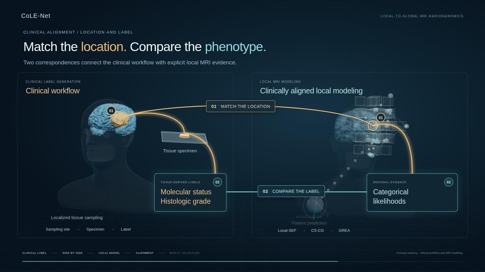

# CoLE-Net


[](https://zhengyao0202.github.io/CoLE-Net/)
[](pyproject.toml)
[](LICENSE)

**Consistent Local-to-Global Evidence Modeling for Glioma MRI Radiogenomics via Geometry-Regularized Aggregation with Biopsy-Site Validation**

Learn regional MRI evidence, connect its context, and aggregate it into patient-level predictions for IDH mutation, 1p/19q codeletion, and histologic grade.




Local Spatial Evidence Field (Local-SEF) produces regional categorical likelihoods. Center–Scale Context Graph (CS-CG) captures overlap, cross-scale nesting, and phenotypic affinity. Geometry-Regularized Evidence Aggregation (GREA) combines these likelihoods through an exact geometry-regularized allocation solver. Regional outputs support direct comparison with recorded biopsy sites.

The study includes **1,997 patients across six cohorts**, with recorded-coordinate biopsy evaluation in **15 patients**. The project page includes the current paper's cohort results and examples of regional evidence, recorded-site pathology, and fold consistency.

## Quick start

```bash
python -m pip install -e .
python examples/make_demo.py
lapsef-train --manifest demo_data/patients.csv \
  --config demo_data/smoke.json --fold 0 --device cpu
lapsef-predict --checkpoint runs/lapsef/fold_0/model.pt \
  --input demo_data/example_00.npz --biopsy 16 16 16 --device cpu
```

For uv, run `uv sync` and prefix the Python and CLI commands with `uv run`. Dependencies use your environment’s package-index configuration.

The synthetic example checks the complete training and evidence-export workflow on a small CPU dataset.

## Train on MRI

```bash
lapsef-train --manifest data/patients.csv \
  --config configs/default.json --output runs/study
```

One command trains all five rotations. `--fold 0` selects a single rotation. Each rotation uses fold `k` for testing, `(k+1) % 5` for validation, and the other three folds for fitting. The best validation macro-AUC selects the checkpoint.

See the [method overview](METHOD.md) for the three model components and regional readouts.

Each NPZ contains:

| Array | Format |
|---|---|
| `image` | float32 `[4, X, Y, Z]`; registered T1, T1CE, T2, FLAIR |
| `mask` | `[X, Y, Z]`; tumor-support mask in `[0, 1]` |

Use intensity-standardized MRI at 1-mm spacing and tumor-centered `160³` ROIs. The network also accepts spatial dimensions divisible by eight. Manifest paths are relative to the CSV:

```csv
patient_id,path,fold,idh,onep19q,grade
subject_001,subject_001.npz,0,1,0,0
subject_002,subject_002.npz,1,0,,1
```

Labels are binary; an empty entry marks an unavailable label. Positive classes are IDH mutation, 1p/19q codeletion, and grade IV. The negative Grade class combines grades II and III.

Training writes a checkpoint and `predictions.csv` with `idh_probability`, `onep19q_probability`, and `grade_probability` for the held-out fold.

## Regional evidence

Prediction writes patient probabilities to the `probability` array in `prediction.json`, in the order given by `tasks`. It also writes `regions.npz`, containing candidate centers, radii, geometry masses, local likelihoods, support measures, and class-specific contributions. `--biopsy X Y Z` queries a 5-mm neighborhood in ROI-local millimeters, with the center of voxel `(0,0,0)` as the origin and axes following the input array.
